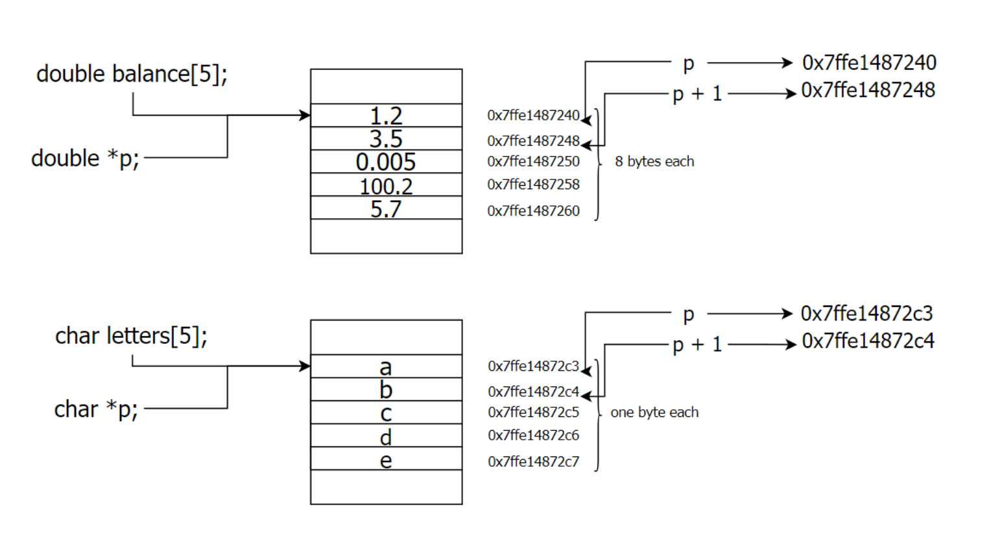

# **C Programming: Understanding Core Concepts**

## **1. Why C?**

C is a powerful and efficient language widely used in system programming, embedded systems, and performance-critical applications. Three major reasons why C remains relevant today are:

- **Portability:** C programs can run with minimal changes across different platforms.
- **Speed:** Faster execution compared to many high-level languages.
- **General-Purpose:** Used for OS development, game engines, and even high-performance computing.

---

## **2. Program Structure in C**

A C program consists of:

- **Preprocessor Commands:** Instructions like `#include` and `#define`, which modify the program before compilation.
- **Functions:** Modular pieces of code, such as `main()`.
- **Variables:** Store data of various types.
- **Statements & Expressions:** Operations performed within the program.
- **Comments:** Help document the code (`//` for single-line, `/* */` for multi-line).

**Example:**

```c
#include <stdio.h>
#define MESSAGE "C programming is powerful!"

int main(){
    // One line comment
    /*
    Multi line comment
    */
    printf("Hello world!\n");
    printf("%s", MESSAGE);
    return 0;
}
```

---

## **3. Compilation and Execution**

### **Compiling a C Program**

C programs require compilation before execution. The process involves:

1. **Preprocessing:** Expanding macros and including header files.
2. **Compilation:** Converting C code into assembly.
3. **Assembly:** Generating machine code.
4. **Linking:** Combining object files into an executable.

### **Commands**

- **Compile only:**
    
    ```bash
    gcc -c main.c  # Creates an object file main.o
    
    ```
    
- **Compile and link:**
    
    ```bash
    gcc main.c
    # equivalent to 
    gcc -c main.c
    gcc main.o
    
    # specify executable name 
    gcc main.c -o myprogram
    ```
    
- Object dump
    
    ```bash
    objdump -d a.out 
    objdump -d main.o 
    objdump -t a.out
    ```
    

---

## **4. Data Types in C**

C supports three main categories of data types:

### **Basic Types**

- `int` (Integer)
- `char` (Character)
- `float` (Single-precision decimal)
- `double` (Double-precision decimal)

| **Type** | **Size (bytes)** | **Format Specifier** |
| --- | --- | --- |
| int | at least 2, usually 4 | %d |
| char | 1 | %c |
| float | 4 | %f |
| double | 8 | %lf |

### **Derived Types**

- **Pointers**: Store addresses of variables.
- **Arrays**: Store multiple values of the same type.

### **User-defined Types**

- **Structures (`struct`)**: Group different data types together.
- **Enumerations (`enum`)**: Define named constants.

**Example:**

```c
#include <stdio.h>

#define N 50

// Define an enumeration
enum Color { RED, GREEN, BLUE };

// Define a structure
struct Point {
     int x;
     int y;
};

int main() {
    int x = N;
    int y = 85;   /* decimal */
    int z = 0213; /* octal */
    int t = 0x4b; /* hexadecimal */
    float a = 3.14159;
    double b = 314159E-5L; /* Exponent: 314159 x 10^(-5) */
    char ch = 'a';

    // Using the enum
    enum Color favoriteColor = BLUE;

    // Using the struct
    struct Point p1;
    p1.x = 10;
    p1.y = 20;

    struct Point p2 = {10, 20}; 

    // Print integer values
    printf("value of x: %d, size of x: %lu bytes\n", x, sizeof(x));
    printf("value of y: %d, size of y: %lu bytes\n", y, sizeof(y));
    printf("value of z: %d, size of z: %lu bytes\n", z, sizeof(z));
    printf("value of t: %d, size of t: %lu bytes\n", t, sizeof(t));

    // Print floating-point values
    printf("value of a: %f, size of a: %lu bytes\n", a, sizeof(a));
    printf("value of b: %lf, size of b: %lu bytes\n", b, sizeof(b));

    // Print character value
    printf("value of ch: %c, ASCII: %d, size of ch: %lu bytes\n", ch, ch, sizeof(ch));

    // Print enum value
    printf("Favorite color: %d (0=RED, 1=GREEN, 2=BLUE), size of enum: %lu bytes\n", favoriteColor, sizeof(favoriteColor));

    // Print struct values
    printf("Point coordinates: (%d, %d), size of struct: %lu bytes\n", p1.x, p1.y, sizeof(p1));
    printf("Point coordinates: (%d, %d), size of struct: %lu bytes\n", p2.x, p2.y, sizeof(p2));
    return 0;
}

```

```c
#include <stdio.h>

#define N 50

// Define an enumeration
enum Color { RED, GREEN, BLUE };

// Define a structure
// struct Point {
//     int x;
//     int y;
// };

// alias
typedef struct Point {
    int x;
    int y;
} point;

int main() {
    int x = N;
    int y = 85;   /* decimal */
    int z = 0213; /* octal */
    int t = 0x4b; /* hexadecimal */
    float a = 3.14159;
    double b = 314159E-5L; /* Exponent: 314159 x 10^(-5) */
    char ch = 'a';

    // Using the enum
    enum Color favoriteColor = BLUE;

    // Using the struct
    struct Point p1;
    p1.x = 10;
    p1.y = 20;

    struct Point p2 = {10, 20}; 

    point p3 = {10, 20};

    // Print integer values
    printf("value of x: %d, size of x: %lu bytes\n", x, sizeof(x));
    printf("value of y: %d, size of y: %lu bytes\n", y, sizeof(y));
    printf("value of z: %d, size of z: %lu bytes\n", z, sizeof(z));
    printf("value of t: %d, size of t: %lu bytes\n", t, sizeof(t));

    // Print floating-point values
    printf("value of a: %f, size of a: %lu bytes\n", a, sizeof(a));
    printf("value of b: %lf, size of b: %lu bytes\n", b, sizeof(b));

    // Print character value
    printf("value of ch: %c, ASCII: %d, size of ch: %lu bytes\n", ch, ch, sizeof(ch));

    // Print enum value
    printf("Favorite color: %d (0=RED, 1=GREEN, 2=BLUE), size of enum: %lu bytes\n", favoriteColor, sizeof(favoriteColor));

    // Print struct values
    printf("Point coordinates: (%d, %d), size of struct: %lu bytes\n", p1.x, p1.y, sizeof(p1));
    printf("Point coordinates: (%d, %d), size of struct: %lu bytes\n", p2.x, p2.y, sizeof(p2));
    printf("Point coordinates: (%d, %d), size of struct: %lu bytes\n", p3.x, p3.y, sizeof(p3));

    return 0;
}

```

---

## **5. Modifiers in C**

Modifiers adjust the range and memory storage of data types.

### **Short and Long**

- `short int` (uses less memory)
- `long int` (stores larger values)

### **Signed and Unsigned**

- `signed int` (default, stores both positive and negative numbers)
- `unsigned int` (stores only positive numbers)

**Example:**

```c
unsigned int x = 300;  // Only positive values allowed
int y = -300;  // Signed integer allows negatives

```

```c
#include <stdio.h>   

int main(){
 short a;
 long b;
 long long c;
 long double d;

 printf("size of short = %lu bytes\n", sizeof(a));
 printf("size of long = %lu bytes\n", sizeof(b));
 printf("size of long long = %lu bytes\n", sizeof(c));
 printf("size of long double= %lu bytes\n", sizeof(d));
 return 0;
}

```

---

## **6. Declaration vs Definition**

- **Declaration:** Informs the compiler about a variable or function.
- **Definition:** Allocates memory or provides implementation.

**Example:**

```c
// Declaration (only informs the compiler)
extern int num;

// Definition (allocates memory)
int num = 100;

```

```c
#include <stdio.h>
// Variable declaration
extern int x;
int main(){
	printf("%d", x); // variable is defined somewhere else
	return 0; 
}
```

---

```c
// main.c
#include <stdio.h>
// Function Declaration: prototype
int add(int a, int b);
int main(){
	printf("%d", add(3, 5));
	return 0;
}
// Function definition
int add(int a, int b){
	return a + b;
}
```

```c
// func.c
#include <stdio.h>
// Function Declaration: prototype
int add(int a, int b);
// Function definition
int add(int a, int b){
	return a + b;
}
```

### Compile and Link

```bash
gcc -c main.c
gcc -c func.c
gcc main.o func.o
```

---

## **7. Header Files and Linking**

### **What Are Header Files?**

Header files (`.h`) store function declarations and macros. They help in **code modularity and reusability**.

**Example (`math_functions.h`):**

```c
#ifndef MATH_FUNCTIONS_H
#define MATH_FUNCTIONS_H

int add(int a, int b);

#endif

```

**Implementation (`math_functions.c`):**

```c
#include "math_functions.h"

int add(int a, int b) {
    return a + b;
}

```

To compile and link:

```bash
gcc -c math_functions.c
gcc -c main.c
gcc main.o math_functions.o -o program

```

---

## **8. Pointers in C**

Pointers store **memory addresses** instead of values.

**Example:**

```c
int var = 5;
int *p = &var;
printf("Value: %d, Address: %p\n", *p, p);
```


### **Use Cases**

- **Dynamic memory allocation**
- **Efficient array handling**
- **Passing large structures to functions without copying data**


```c
#include <stdio.h>
int main(){
    int var = 5;
    printf("var: %d\n", var);
    // Notice the use of & before var
    printf("address of var: %\n", &var);
    int *pvar;
    pvar = &var;
    printf("value of pvar: %p"\n, pvar);
    // To access value pointed by pvar
    printf("value %d\n", *pvar);
    return 0;
}
```

```c
#include <stdio.h>
int main()
{
    int var = 5;
    printf("var: %d\n" , var);
    // Notice the use of & before var
    printf("address of var: %p\n", &var);
    int *pvar;
    pvar = &var;
    printf("value of pvar: %p\n", pvar);
    // To access value pointed by pvar
    printf("value %d\n", *pvar);
    *pvar = 1;
    printf("%d", var);
    return 0;
}
```


#### Pointer types matter


```c
#include <stdio.h>
int main(){
    char c = 'A';
    char *pc = &c;
    char **ppc = &pc;
    printf("address of c %p", pc);
    printf("address of pc %p", ppc);

    //int x = 5;
    //int *px = &x;
    //ppc = &px; // Not valid! types do not match! (char **, int **)
    return 0;
}
```


#### Type casting

```c
#include <stdio.h>
int main()
{
    char *p;
    int x;
    // raise a warning
    p = &x;
    // type casting 
    p = (char *) &x; 
    return 0;
}
```
---

## **9. Void Pointers**

A **void pointer** is a generic pointer that can hold addresses of any data type.

**Example:**

```c
void *ptr;
int x = 10;
char ch = 'A';

ptr = &x;  // Holds an int address
ptr = &ch; // Holds a char address

```

### **Use Cases**

- Generic memory allocation (`malloc` returns a `void *`).
- Writing **generic functions** that accept multiple data types.

---

## **10. Function Pointers**

A **function pointer** stores the address of a function.

**Example:**

```c
#include <stdio.h>

void greet() {
    printf("Hello from a function pointer!\n");
}

int main() {
    void (*funcPtr)();  // Declare function pointer
    /* the ampersand is actually optional */
    funcPtr = &greet;   // Assign function address
    funcPtr();          // Call function
    return 0;
}

```

### **Use Cases**

- **Callback functions** (e.g., `qsort` in C standard library).
- **Replacing switch-case** statements.

---

## **11. Pointers to Arrays**

A pointer can also point to an **array**.

**Example:**

```c
int numbers[] = {10, 20, 30};
int *p = numbers;  // Pointer to the first element

for(int i = 0; i < 3; i++) {
    printf("Value: %d, Address: %p\n", *(p + i), (p + i));
}

```

### **Use Cases**

- Iterating over arrays efficiently.
- **Passing arrays to functions** without copying data.

```c
#include <stdio.h>
int main () {
    double balance[5] = {1000.0, 2.0, 3.4, 17.0, 50.0};
    double *p;
    int i;
    p = balance;
    for ( i = 0; i < 5; i++ ) {
        // printf("balance[%d] : %f\n", i, balance[i] );
        // printf("*(balance + %d) : %f\n", i, *(balance + i) );
        printf("*(p + %d) : %f associated address %p\n", i, *(p + i), p + i);
    }
    return 0;
}
```
```c
#include <stdio.h>
int main () {
char letters[5] = {'a','b', 'c', 'd','e'};
    char *p;
    int i;
   
    p = letters;
    for ( i = 0; i < 5; i++ ) {
        printf("*(p + %d) : %c associated address %p\n", i, *(p + i) , p + i);
    }
    return 0;
}
```


---

## **12. Reading Complex Pointer Declarations**

C uses a **right-left rule** to interpret pointer declarations.

**Examples:**

- `int (*p)[5];` → Pointer to an **array** of 5 integers.
- `int *p[5];` → Array of **5 pointers** to integers.
- `int (*func)();` → Pointer to a function returning an `int`.
- `int *func();` → function returning pointer to `int`.


---

## **Final Thoughts**

Understanding C's **memory management, pointers, and linking process** is key to writing efficient and modular programs. These concepts are widely used in:

- **Operating systems (e.g., Linux kernel)**
- **Embedded systems (e.g., microcontrollers)**
- **Game development (e.g., graphics rendering engines)**
- **Networking (e.g., TCP/IP protocol implementations)**

By mastering these core principles, you'll develop a **deeper understanding of system-level programming** and optimize performance-critical applications.
